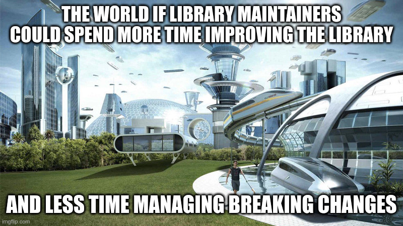

{class="dropCap"}aul Graham
[said](https://x.com/paulg/status/1373926244673323008)

> The base state of programming is gluing together library calls. Since glue code can be written in any language, most programmers' language preferences are really library preferences.

This is provocative in my favorite way. There is a truth here: libraries are supremely important, and will only become more important as the software world expands. Libraries are the software world's tool for the division of labor. [Ask Adam Smith](https://en.wikisource.org/wiki/The_Wealth_of_Nations/Book_I/Chapter_1): the larger the industry, the higher the degree of the division of labor. As software eats the world, libraries will eat software.

But from a different perspective **most programmers' library preferences are really language preferences**. Libraries don't manifest out of thin air. They are written in a programming language, and the nature of the programming language influences the nature of its libraries, in two ways. 

1. There's a *first-order effect*: the features of a programming language can enable libraries that provide more help for users. For example:
    * **Metaprogramming:** Ruby and Python, for example, have metaprogramming features that allow libraries like Rails and Django to exist, where you just define a class, define some properties and relations on it, and then you get a bunch of definitions for free: methods to do database lookups and property edits and whatnot -- pretty cool if you're into that sort of thing.
    * **Fancy types:** Rust and Haskell have linear types, which give library authors the ability to provide compile-time detection for certain types of user errors like resource leaks.

    This isn't really specific to *libraries* per se, languages that permit you to write more expressive code also permit you to use more expressive[^1] (and therefore more helpful) libraries. Go to your nearest Hacker News comments section and I'm sure you can find plenty of discussion about the sorts of things that make a programming language expressive.

2. The *second-order effect* is what I'm more interested in discussing here. A programming language that makes it easier to *improve* libraries -- and makes it easier for users to receive those improvements -- will tend to have better libraries.

## The cost of breaking changes

I am a library maintainer. It's been most of my day job for five years. I work on libraries (for wrapping a large REST API) in 7 different programming languages.

In this work, I spend an inordinate amount of time and energy thinking about breaking changes. *Wait -- was that helper function I changed properly marked as internal-only? Wait -- better add this new keyword argument to the end of this Python method, just in case some user is passing things positionally. Wait -- this class wasn't marked as final so that means technically a user could be extending it and using their own constructor, I can't assume that this is the only possible constructor for this object.*

Breaking changes are a particular challenge in library work, I think

* **You can't really see how your code is being used.** Library code runs on your user's server, not your own. You have to imagine[^2]. And there are so many things to imagine:
* **There are many different ways for users to depend on your code**. Contrast this to e.g. a REST API[^3]. With a REST API, users interact in two ways: passing fields on an endpoint, and reading fields off a response. Meanwhile, with a *library* API, they can inherit from classes, they can catch exceptions, they can import symbols, they can detach methods from their prototypes, they can use reflection, they can take the types you define and pass them to type-level functions, and so on.

I'm on constant guard against my changes being breaking in some subtle, unintended way. I look for ways to avoid a change being breaking. When I do discover I need to make a breaking change (subtle or not), I work hard to try and land the breaking change in the least disruptive way possible. This takes effort.

### User personas

There's a practice "user personas" I've picked up from working with product and design people. The idea is to have a specific type of user in mind when you are designing software. Perhaps I want to think about (images generated by Midjourney). 

{class="persona"}

Or maybe

{class="persona"}

I would love to spend my time building for Taylor and Harley. But too often the user that I find myself thinking about is neither of those two noble souls, but foul

![Mayhemus McWreckington, the user bent on using the library in the squirrelliest possible way, the user who reaches in to all my library internals that aren't properly marked as private, who extends all my classes that really ought to be marked as final, who keys off the presence of that null value where I want to begin putting something meaningful, who uses a dependency injection framework that uses reflection to figure out what parameters to use to construct instances of my classes, who calls all Python methods positionally, who initializes all Go structs positionally, who takes all the type symbols provided by my library and uses them as the input into bizarre, type-level programs.](../images/mayhemus.jpg){class="persona"}

Every maintainer faces this dilemma: abandon your discipline around breaking changes, or let your ability to improve things for actual users be constrained by hypothetical edge cases.

We all lose here. Every improvement a maintainer chooses not to ship because it breaks imaginary users means a worse library for the rest of us. Every moment a maintainer spends on workarounds to avoid breaking changes, or on managing the breaking changes they do ship -- e.g. delaying them so many breaking changes can be bundled, managing deprecation, writing migration instructions -- is a moment they don't spend on improving other, more tangible aspects of the library.

{style="width:80%"}

## Tips for library maintainers

There are things you can and should do as a library maintainer to reduce the toll of breaking changes on your own library:

* Run a tool in CI[^4] that detects breaking changes. Less burden on you to catch things.
* Be very conservative with your public interface. Default to making everything private or else final and readonly and whatever other limiting modifiers you can think of.
* Explicitly disallow "weird" usage patterns inside your documentation. The [semver spec](https://semver.org/) says that your public interface is what you declare it to be, and you are allowed to say "the shape of the library under reflection is not considered part of the public interface" if you want to, or "only classes that are explicitly documented as such are allowed to be subclassed".

Doing this consistently makes a difference but can't eliminate the burden completely. And these lessons aren't immediately apparent; many libraries rise to popularity before the maintainers have learned them, and applying them retroactively is a tough nut to crack. My take is that this really is an industry-wide tooling problem. It needn't just be on maintainers to know and be responsible for all this -- our tools and programming languages should enable and encourage the right practices from the get-go.

## It doesn't have to be this way

What could change in our programming languages and tools to reduce the cost of breaking changes? I have a list. These are the things I would be thinking about if I were contributing to a programming language or its tools and trying to build the most library-friendly programming language in the world.

### Codemod-powered upgrades

I'd like to see better, standard tooling around codemods. If robust codemods were easy enough to write, maintainers could begin including codemod definitions with new versions of their library, capable of automatically modifying a user's code to be compatible with otherwise breaking changes. If this were standard practice, the package manager could run codemods automatically as a user upgrades from an old version, and maintainers could then begin to treat as non-breaking any change whose migration could be automated. While writing this post I listened to an  [episode of the "Changelog" Podcast](https://changelog.com/podcast/597) where [Predrag Gruevski](https://predr.ag/), maintainer of the ["cargo-semver-checks" tool](https://github.com/obi1kenobi/cargo-semver-checks) for Rust, [calls for much the same thing.](https://changelog.com/podcast/597#transcript-54)

Only some types of breaking change can be smoothed over via codemod. For example, let's take two breaking changes that have happened in the popular ExpressJS library. In ExpressJS v5, the `.del` method is removed in favor of `.delete`, certainly a migration that could be completely automated via codemod. On the other hand in ExpressJS v4, the `.routes` method is removed without replacemen; if you need to list all the routes mounted in your Express app, you need to start keeping track of that yourself as you mount them. This change can't realistically be tackled with a codemod.

Codemods might only be able to smooth over simple types of breaking change -- renames, changing defaults, splitting method calls, etc. -- but while simple, these types of change are still valuable. Library code, like all code, evolves. Names that used to make sense become confusing. Defaults that used to be helpful turn out to clash with new use cases. Think of how often you do renaming and refactoring of internal code: our libraries suffer because of how burdensome making small changes like this to a library is for both maintainers and users.

Codemods for library upgrades isn't commonplace in the status quo, but it exists. There's [react codemod](https://github.com/reactjs/react-codemod) that uses [a library `jscodeshift`](https://github.com/facebook/jscodeshift) and provides some commands to help with specific steps of certain React migrations. There's [openrewrite](https://docs.openrewrite.org/) for Java, and tools written on top of it such as [Spring boot migrator](https://github.com/spring-projects-experimental/spring-boot-migrator?tab=readme-ov-file). In PHP land there's a [paid service](https://laravelshift.com/) that helps people automate their Laravel version upgrades.

Something I think needs to change is that *type-directed* codemods need to become the standard. The story for codemods almost everywhere (the exception being [openrewrite](https://docs.openrewrite.org/concepts-explanations/lossless-semantic-trees) ) is that you define it entirely in terms of ASTs. This is how [`jscodeshift`](https://github.com/facebook/jscodeshift) works, at least, and if you wanted to do codemods in Python or Go the Internet seems to think the way you would do it is to use the `ast` package that they provide in their respective standard libraries. 

The problem with ASTs though, is that an AST is just a *syntactical* structure. It doesn't really reflect anything about how the *semantics* of the programming language *works*. Manipulating ASTs is only one level more structured than manipulating text with regexes. A critical example: an AST doesn't give you any help if you want to *find references*. Suppose you're in Typescript and trying to write a codemod to do that ExpressJS `.del` -> `.delete` migration on instances of `express.App`. You have to
1. Find something that looks like it's an an import of `express`.
2. Find something that looks like it's a function call to the result of the `express` import (to instantiate an express app).
3. Find something that looks like it's a call on `.del` to the result of that function call to the result of the `express` import. 
4. Pray that there are no re-assignments or function boundaries in between these events, because if there are, your codemod isn't realistically going to be able to track them and will drop the ball, you'll have to be satisfied with a codemod that only actually triggers in say, 90% of the scenarios in which it might need to. A 90% success rate is useful, but won't cut it if the goal is reliable touch-free automation of library upgrades.

Meanwhile, my LSP has "find all references" built-in and a "rename" feature that does exactly this, no guesswork involved (yes, `any` can interfere, but users understand that allowing `any` into your Typescript codebase amounts to voluntarily opting out of having nice things, unlike the everyday sorts of things that tend to break AST-only code triangulation: doing an assignment, breaking out a function, etc.)

If codemod-powered library upgrades are to arise, they will need to be type-aware. Purely syntactic codemods are simply too hard to write and too unreliable. Most dynamically-typed languages now have robust gradual type systems available now, so I'm an optimist. 

### More granular breakingness

Maintainers should be able to be more specific than labeling every release simply "breaking" or "non-breaking". What, precisely, broke? 

With today's technology, if I make a breaking change to a small part of my library -- say, a parameter that only 1% of users use -- there is no way for my release to be treated as major just for those users. I have to release a major version for everybody, which means 99% of users unnecessarily pay a *cost of vetting*. "Cost of vetting" is worth deconstructing. There's a continuum of vetting practices, between two extremes:

* **Heavy vetters** -- these (rare) users conscientiously read the release notes to verify they aren't implicated before they bump a major version. Heavy vetters, because they are so careful, pay a cost for every major version, whether they actually suffer breakage or not.
* **Light vetters** -- these users essentially treat major versions no differently than minor versions, and pull major versions wholesale from all their dependencies at once, and only investigate what breaks in CI. 

Because of heavy vetting, a library maintainer might choose to avoid certain breaking changes, whose benefit to users or to the ease of library maintenance doesn't exceed the cost to heavy vetters, or delay the breaking changes to bundle them together in a single major version. 

The cost of light vetting is more subtle. Light vetting, in a sense, defeats the purpose of semantic versioning altogether. If I can't trust that users will pay attention to the changes in a major unless it breaks their CI, then if I have a change that I actually need users to pay attention to, then bumping the major version is not enough to signal this -- I have to make sure my change breaks their CI. 

This often comes up when you're considering changing defaults. For example, suppose my library makes network requests, and for years I have hardcoded into the library a decision to always use IPv4 unless IPv6 is explicitly enabled. Perhaps this made sense and led to less user trouble ten years ago, when IPv6 support was less universal, but these days IPv6 is much more mature and cloud vendors even offer IPv6-only environments, and having IPv6 something for which you have to explicitly enable support is almost certainly no longer the thing that leads to the lowest friction for a new user on average. But if I change the default, and users pull the update, it is very possible that a user with certain network settings or very locked-down firewall rules would break. And this, unfortunately, is exactly the sort of thing that would fail in a production environment but succeed in CI and testing environments.

If you could actually rely upon users to read and obey the release notes, there would be no risk. At it is, you can make this change in a major, let users break, and take solace in the fact that in a legalistic sense you are not in the wrong. According to semver you are allowed to make breaking changes in majors and it is the user's "fault" for not reading the release notes if they break. But if what you care about is preventing your users from having bad experiences -- not just avoiding being at fault for them -- it just isn't realistic to expect that users will read the release notes. The modern software application uses too many libraries, and the signal-to-noise of major releases is too low.

 A way for tools to address this problem would be a finer-grained concept of "breaking change". Maintainers should be able to specify which *parts* of a library are subject to breakage, and users (with the help of their tools) should specify which *parts* of the library are used by their project, and this information should be used to determine which releases to automatically pull, not the coarse "breaking/non-breaking" distinction. Pull this off and breaking changes become less disruptive for those they do not affect, and the signal-to-noise ratio of reading the release notes that are flagged for you is much more favorable.

As with codemods, types may be a big part of the story here. The type system has a pretty definitive answer to "do I use subject-to-breaking-change part X part of library Y" -- this is just checking if "find all references" returns an empty result or not. In theory, you can also get (even more granular) usage information with run-time mechanisms, if you have sufficient test coverage.

### Library-Level Access Control

A feature that few programming languages provide is library-level access control. Many programming languages have no access control to speak of, and many of those that have access control do not provide it at the **library** level. 

* Java, for instance, provides access control only at the *package* and *class* levels. This would be fine, except most Java libraries are not just a single package: they are several packages, because the package is Java's primary namespacing mechanism. You therefore have a dilemma, if you make a method `public` then the world can use it. If you make a method `package protected` then its inaccessible to other packages in the library. There is no way to make a method accessible to other packages in your library, but not the world.
* C# does better here. It has an "internal" access control keyword which makes its target inaccessible to the outside world but public to everybody inside your "assembly". Usually a C# library is a single assembly. An assembly can contain several namespaces.
* Rust also does better. There is a [module hierarchy](https://doc.rust-lang.org/reference/visibility-and-privacy.html), so things can be public within your hierarchy but hidden at the root. Libraries have a single root module.
* Go, like Java, only gives you access control at the package level, and libraries often contain multiple packages because the package is Go's only namespacing construct.
* PHP only gives you access control at the class level.
* Ruby and Python provide no access control to speak of, although in Python [typecheckers may respect](https://microsoft.github.io/pyright/#/typed-libraries?id=library-interface) the convention that names beginning with an underscore are library-private. 
* In Typescript you can accomplish the effect of internal-only types by exporting different types to your users than what you use internally. I know of but have not used [API Extractor](https://api-extractor.com/pages/tsdoc/doc_comment_syntax/) which provides `@public`, `@private` annotations.

This is mostly just an inconvenience. You can always use docstrings to mark something as internal. But in my opinion, every programming language serious about libraries should enforce access controls, or at a bare minimum, ratify a standard. Tools to detect breaking changes (and enforce semver?) can't work unless there's an agreed way for library maintainers to declare what's actually in the public interface.

### Unison

I don't think a post on library upgrade experience would be complete if I didn't mention the programming language [Unison](https://www.unison-lang.org). In Unison, [things are referenced](https://www.unison-lang.org/docs/the-big-idea/) by *a hash of their syntax tree* instead of by *name*. This has several implications, but among other things it makes for an interesting library upgrade story. Several different versions of a single library can coexist peacefully in the same Unison project, so if you need something from the newest version of a library [you don't necessarily need to](https://www.unison-lang.org/docs/the-big-idea/) stop the world, upgrade all your existing usage of the library to be compatible with the latest version first, before bumping a single, project-wide version. You can very naturally just grab the latest version of the library and start using it *in addition* to the older version of the library that you are already using. You can consolidate things later, if it becomes convenient or proves to be logically necessary. When you do wish to do a project-wide upgrade, the a Unison tooling [partially automates](https://www.unison-lang.org/docs/usage-topics/workflow-how-tos/update-code/#upgrade-workflow) this with its [structured refactoring](https://www.unison-lang.org/docs/the-big-idea/#structured-refactoring) capabilities. Also because references are by-hash and not by-name, renames are non-breaking. So in theory, breaking changes in a Unison library promise to be less disruptive to users than breaking changes to a library in a more typical programming language.

I haven't used Unison too seriously, so I can't speak authoritatively to how things shake out in practice; but I will say if you've never played around with Unison, you should. It's ambitious. I wish more developer tools aimed so high.

## Don't just click away and forget

I hope I've convinced you 

* the library experience around breaking changes is poor and has room to improve 
* this is costly, not just to library maintainers but to everybody

The next time you are selecting a programming language for an important, long-term project, the next time you are advising a friend which programming language they should choose to build their career around,  the next time that you are sitting down to a fancy dinner with the core team of the world's most promising programming language, the next time you are sounding off your unsolicited programming language opinions on Hacker News -- think of the library maintainers. Shake your fist at Mayhemus McWreckington. Remember that he is why we can't have nice things, even though he probably doesn't even really exist.

[^1]: I watched a ["Papers We Love" talk](https://www.youtube.com/watch?v=43XaZEn2aLc)
 about a paper that tries to formalize the notion of what it means or a programming language to be "expressive". I recommend it if you're PL-theory-curious. 

[^2]: You can get a *little* insight into how users are using your library with telemetry. But you're never really going to be able to get answers to questions like "are any users extending this class?" with telemetry that you collect pre-emptively (unless your telemetry is terrifyingly invasive), you have to deploy a new version and you'll only get answers for users that upgrade. Telemetry has its uses but is really quite limited.

[^3]: It might seem a little weird that, as I mentioned, the libraries I maintain are for wrapping a REST API, but then I'm contrasting how libraries are subject to more types of breaking change than REST APIs are. What gives? It turns out that (a), depending on how your REST API gets reflected into the libraries that wrap it, some changes that aren't strictly *breaking* on a data-over-the-wire level can correspond to a breaking change to e.g. the class structure that describes it inside your SDK, and (b) REST API wrapper libraries also contain a fair amount of "infrastructure" code, that needs to evolve as new patterns appear in the API it wraps, or to adapt to more user environments.

[^4]: In .NET there is something called the [Baseline Version Validator](https://learn.microsoft.com/en-us/dotnet/fundamentals/apicompat/package-validation/baseline-version-validator) For Java, the best tool I know of is [this ancient perl script](https://github.com/lvc/japi-compliance-checker). For Go, there is [gorelease](https://pkg.go.dev/golang.org/x/exp/cmd/gorelease). For Typescript, you should read the [semver-ts spec](https://www.semver-ts.org/index.html), and especially the section on [tooling](https://www.semver-ts.org/appendices/b-tooling.html#detect-breaking-changes-in-types). For Rust there is [cargo-semver-checks](https://github.com/obi1kenobi/cargo-semver-checks). For other languages, if you know of any good tools, please let me know!
