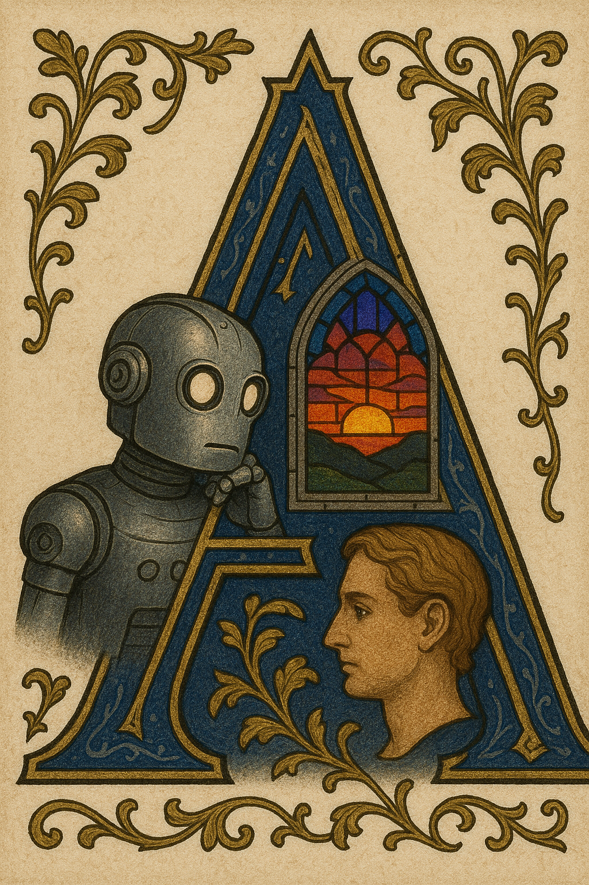

lan Turing wrote "at the end of the century the use of words and educated opinion will have altered so much that one will be able to speak of machines thinking without expecting to be contradicted."

As far as casual conversation, he was right. I speak casually of GPT-o3 "thinking" and nobody bats an eye. Speak of machines thinking as a formal matter of philosophy, though, and you will be contradicted -- by the Roman Curia's recent doctrinal note about artificial intelligence, [*Antiqua et Nova*](https://www.vatican.va/roman_curia/congregations/cfaith/documents/rc_ddf_doc_20250128_antiqua-et-nova_en.html), no less.

This was a bit of a surprise to me. (Nobody expects the Roman Inquisition!) The fairness of the Turing test has always struck me as somewhat self-evident, and the thought had never really occurred to me you could pose serious objections. This post is the distillation of what (after several reads) I understand the Church's challenge of the Turing Test to be, alongside relevant parts of argument that Turing originally advanced in ["Computing Machinery and Intelligence"](https://courses.cs.umbc.edu/471/papers/turing.pdf). I don't think you have to be Catholic to find this interesting.

## Turing: a fair test considers the intellect in isolation

Turing's position is that the question "can machines think?", thus stated, is "too meaningless to deserve discussion". He spends much of his essay anticipating objections to the Turing Test, but doesn't offer much in the way of *positive argument* for it. He asserts simply that it "has the advantage of drawing a fairly sharp line between the physical and the intellectual capacities of a man".

## The Church: nope, intelligence comes from the whole person

Here is my paraphrase of *Antique et Nova*'s argument re: the Turing Test.

1. The Turing Test evaluates "intelligence" by performance on a task: the interactive imitation of written human discourse.
2. Sure, imitating human discourse is a task that requires a degree of sophistication, but human intelligence is more than just sophistication in the ability to perform tasks, being intelligent includes many other things. There are intelligent activities like "willing, loving, choosing, desiring". Intelligence is also a *conscious experience* with a certain nature ("embodiment", "relationality", a "drive toward truth").
3. These activities and experiences aren't just incidentals that happen to accompany human intelligence. They are important for theological reasons and essential to what it means to be "made in God's image".
4. AI merely has a sophistication in performing tasks. It doesn't have any of human intelligence's other trappings.

It's fairly challenging to pull quotes from the document that distill the structure of the entire argument, This one I found fairly evocative:

> Since AI lacks the richness of corporeality, relationality, and the openness of the human heart to truth and goodness, its capacities—though seemingly limitless—are incomparable with the human ability to grasp reality. So much can be learned from an illness, an embrace of reconciliation, and even a simple sunset; indeed, many experiences we have as humans open new horizons and offer the possibility of attaining new wisdom. No device, working solely with data, can measure up to these and countless other experiences present in our lives.

## Turing: so we're solipsists now?

Can AI gain wisdom from a sunset?

You can stream your camera to ChatGPT and have a sophisticated conversation with it about the setting sun, certainly. If we played the imitation game, em dashes and "delve" aside I might have difficulty telling it from a human.

But for *Antiqua et Nova*, the capacity to *imitate* such things does not meet the bar for intelligence. You must have the capacity to *actually experience* them. Turing anticipates this line of argument, calling it the "objection from consciousness", and argues that it collapses into solipsism.

> According to the most extreme form of this view the only way by which one could be sure that machine thinks is to be the machine and to feel oneself thinking... according to this view the only way to know that a man thinks is to be that particular
  man. It is in fact the solipsist point of view. It may be the most logical view to hold but it makes communication of ideas difficult. A is liable to believe "A thinks but B does not" whilst B believes "B thinks but A does not." instead of arguing continually over this point
 it is usual to have the polite convention that everyone thinks.

Put a different way: all that we demand from our fellow humans to accept that they are intelligent is a display of intelligence in their external behavior. Why should we insist for more than this from machines? The only intelligence we can directly observe is our own.

## Catholic scholars: we aren't solipsists, we just don't disregard physical nature

*Antiqua et Nova* doesn't grapple with this directly, but in a footnote it references the book ["Encountering Artificial Intelligence"](https://jmt.scholasticahq.com/article/91230-encountering-artificial-intelligence-ethical-and-anthropological-investigations), put together by an AI Research Group organized by the Holy See, where a detailed argument is presented. This is from a passage not about machine intelligence in general, but about a related, narrower question about robot-human friendship:

>For one thing we share identical material conditions—the same biology—with the other humans who behave like us. And a common biology underlying common behavior makes the existence of a common interior experience more plausible; that is, shared biology is the “middle term” between observable shared behavior and unobservable shared experience. The robot’s lack of a nervous system, on the other hand, gives us reason to intuit that it might not have the interior states that would allow it to accomplish mutuality and authenticity, even if we observe similar behavior.

This proposes a justification for the double standard. Sure, we don't fully understand how consciousness arises, but I know I am conscious, it's reasonable for me to suppose my conscious experience might have something to do with my physical nature, so there is grounds for me more highly favoring true conscious intelligence as an explanation for sophisticated behavior from systems whose physical nature is closer to mine.

We shouldn't "rule out machine consciousness a priori" and completely foreclose upon the idea that something physically different than us could be intelligent, but we also shouldn't artificially restrict what knowledge we consider in judging this, as the Turing Test suggests.

My editorial: today's LLMs will tell you they are conscious if you ask them. But this seems less authentic because today's LLMs are created essentially as imitation machines on datasets that include humans describing what consciousness is like. Perhaps someday, AIs created through some other means would describe conscious experience, and it would be another story.

## Domain errors

Turing, the founding father of Computer Science, is primarily concerned with predicting what digital computers will become able to do. The Vatican, on the other hand, is concerned with speaking to ethical and religious questions about intelligence and what it means for man's relationship with the machine, fellow man, and God. 

Turing reads to me as quite frustrated with domain errors -- people taking ideas from theology or philosophy and applying them inappropriately to interfere with the scientific inquiry into what behavior it will be possible to elicit from machines -- "machines will never be able to be rational because rationality comes from the soul and God only gives souls to people" and so forth.

The Church also reads to me as attempting to correct a domain error. When discussing the technical capabilities of machines it might be convenient to use "intelligence" as a shorthand for a human-level sophistication in performing tasks. But when you're moved on to questions of ethics, philosophy and theology, the interior experience of intelligence seems important. 

## Final notes

If you've made it this far, you should read ["Computing Machinery and Intelligence"](https://courses.cs.umbc.edu/471/papers/turing.pdf), [*Antiqua et Nova*](https://www.vatican.va/roman_curia/congregations/cfaith/documents/rc_ddf_doc_20250128_antiqua-et-nova_en.html), and ["Encountering Artificial Intelligence"](https://jmt.scholasticahq.com/article/91230-encountering-artificial-intelligence-ethical-and-anthropological-investigations) yourself! I have no formal training in philosophy or theology, so you should take my paraphrases and summarizations with some skepticism as I probably am missing subtleties of meaning. That last source ["Encountering Artificial Intelligence"](https://jmt.scholasticahq.com/article/91230-encountering-artificial-intelligence-ethical-and-anthropological-investigations) includes a survey of the arguments made by modern philosophers on artificial intelligence in this area, which I found very helpful.

