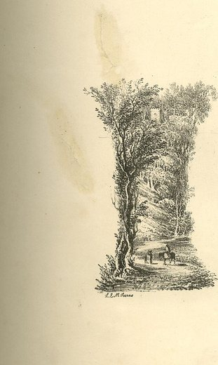

 read the Pope's new encyclical, [*Magnifica Humanitas*](https://www.vatican.va/content/leo-xiv/en/encyclicals/documents/20260515-magnifica-humanitas.html).

It's a long document, with many purposes and many audiences. What stood out to me were a few passages related to *market ideology*, so to speak. I'm attuned to this as I used to study economics and have leaned libertarian at some stages of my life.

## Pope Leo: The right to private property is (in)violable

The Pope calls for the AI industry to be subject to oversight and regulation.

> Robust legal frameworks, independent oversight, informed users and a political system that does not abdicate its responsibility are required… What is needed is a more active political involvement that is capable of slowing things down when everything is accelerating… it is essential that the use of AI, especially when it touches on public goods and fundamental rights, be guided by clear criteria and effective oversight, grounded in participation and subsidiarity. (MH 106–108)

But what about property rights? Shouldn't the owners of businesses be allowed to do what they like with their property?

> Certainly there is a right to private property, which has its own specific meaning and purpose, yet it is always subordinate… In the Church's tradition, property has been viewed as a means of protecting and managing goods so that they may better serve the common good. Since "the Christian tradition has never recognized the right to private property as absolute or inviolable," its social function must not be considered a mere theological opinion, but a doctrine of the Church, already present in Sacred Scripture and in the writings of the Church Fathers. (MH 66)

So is the Pope a socialist? A communist?

> It is the State's responsibility to ensure cohesion, unity and the proper organization of civil society, so that the common good can be pursued with everyone's contribution. In practical terms, this means that public authorities have the delicate duty to "harmonize the different sectoral interests with the requirements of justice," seeking a balance between individual interests and the common good, without leaving behind the most vulnerable. (MH 63)

This isn't quite "from each according to his ability, to each according to his need", but it reads to me like "socialism would be fine if socialism were the best thing for upholding the common good."

So how about it? Is socialism the best thing for upholding the common good? Certainly not, if you go back a Leo. Leo XIII writes in [*Rerum Novarum*](https://www.vatican.va/content/leo-xiii/en/encyclicals/documents/hf_l-xiii_enc_15051891_rerum-novarum.html):

> Hence, it is clear that the main tenet of socialism, community of goods, must be utterly rejected, since it only injures those whom it would seem meant to benefit, is directly contrary to the natural rights of mankind, and would introduce confusion and disorder into the commonweal. The first and most fundamental principle, therefore, if one would undertake to alleviate the condition of the masses, must be the inviolability of private property. (RN 15)

So what gives? Here's the 1891 Pope Leo saying the inviolability of private property is fundamental, but then you've got 2026 Pope Leo saying private property has never been recognized as inviolable (while referencing *Rerum Novarum* left and right and even dating MH to its 135th anniversary, to the day)? Explain this?!?

Best I can tell, there are two different things meant by "right to private property". There is the right *to hold anything in private whatsoever*, which 1891 Leo said was inviolable, contra socialists who wanted to abolish the entire institution; and then there is the right that *what you hold in private is not interfered with by the state*, which 2026 Leo says **is** violable, contra libertarians who think the state has no business regulating private affairs.

-----

## Efficiency

When I studied economics, there was an important idea called [Pareto efficiency](https://en.wikipedia.org/wiki/Pareto_efficiency).

The reason Pareto efficiency is important is because economists don't want to compete with the Pope – that is, they really want to see themselves as scientists and not moralists. They want to be able to draw a separation between "positive economics" (making objective predictions about the economy and what the results of economic policies will be) and "normative economics" (giving subjective recommendations for which economic policies are right).

The way Pareto efficiency works is, you don't say whether a particular economic result is *good* or *bad* – instead, you say whether a particular result is *efficient* or *inefficient*. It's *inefficient* if there's another possible result that would make at least one person better off without making anyone worse off. It's *efficient* if every other possible result would make at least one person worse off.

Then for the rest of economics 101 the story is learning simple economic models where free markets – outside special circumstances ("market failures") – lead to efficient outcomes. The prescription that falls out of this is *redistributionism*. Outside market failure, you should leave markets alone, and if you find the results to be unjust, you should simply **redistribute** after the fact. In other words, you should organize the economy to generate as much wealth as possible. No worries if that creates a bunch of mega-billionaires and then an underclass. If you want to, Robin Hood it up and make things fair by taking from the rich and giving to the poor. This thinking tends to favor policies like [Universal Basic Income](https://en.wikipedia.org/wiki/Universal_basic_income). Direct transfers of money are the most efficient form of redistribution.

Pope Leo criticizes redistribution as a panacea directly:

> Just laws and methods of redistribution are certainly necessary for correcting imbalances, including tax systems that lighten the burden on the weakest and ask for more from those with greater resources. However, the pursuit of social justice should not be considered a separate issue that follows only after the production of wealth, as if the economy existed solely to create wealth, with politicians only intervening afterwards in order to distribute it. Indeed, justice concerns every phase of economic activity, from resource acquisition to financing, and from production to consumption; every choice has moral consequences. (MH 162)

As a specific example of the moral dimension that redistribution can't address, there's what he says about the dignity of work:

> Work remains a fundamental dimension of the human experience, for not only is it a means of sustenance, but it is also a context for expression, relationships and contributing to the community. Therefore, the problems related to work extend beyond the income necessary for family survival. A society that guarantees employment to only a small fraction of the population, despite having a high level of technical development, risks exposing many to forced inactivity, a lack of responsibility and the absence of daily tasks and stimuli, resulting in human and cultural impoverishment. This creates a paradox of material progress and anthropological regression that undermines the foundations of a just and stable social peace. For this reason, the Church's Social Doctrine insists that access to work for all must be a high priority for public policies and economic processes, serving as a criterion for evaluating the human quality of any development model. (MH 154)

So imagine AI comes along, creates a whole bunch of material wealth but at the same time creates mass unemployment – a scenario anticipated by some prognosticators. Maybe the government gives us our UBI checks and we can spend it all on more consumer goods than we ever dreamt of, and hey we can probably afford great healthcare too. By the measure of GDP and in terms of efficiency, this is a win.[^econ101] But for the Pope, the level of wealth in society isn't as important as questions like, is everybody participating and communing together?

## Go Forth And Encycle

The Internet is full of people whose take is "oh wow, the Pope wrote some thoughtful sentiments about AI, how quaint", but I didn't see it that way at all. It came off to me like an intellectual challenge to various Silicon Valley ideologies. He goes after transhumanism and utilitarianism, too. Anyway, consider reading it. The "encyclical" genre is a good change of pace from the barrage of hot AI takes on X and LinkedIn.

[^econ101]: Of course, research economists have very sophisticated welfare models. They could probably even take a stab at modeling the Pope's perception of "the common good". However, research economics isn't what they teach to all the MBAs and isn't the ideological underpinning of Silicon Valley's investor class. Economics 101 is.
